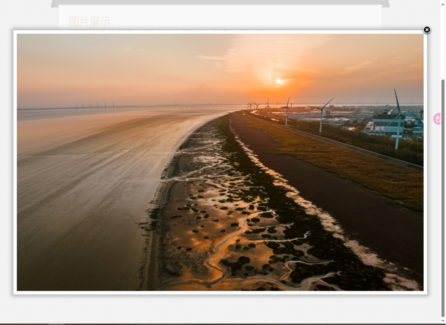
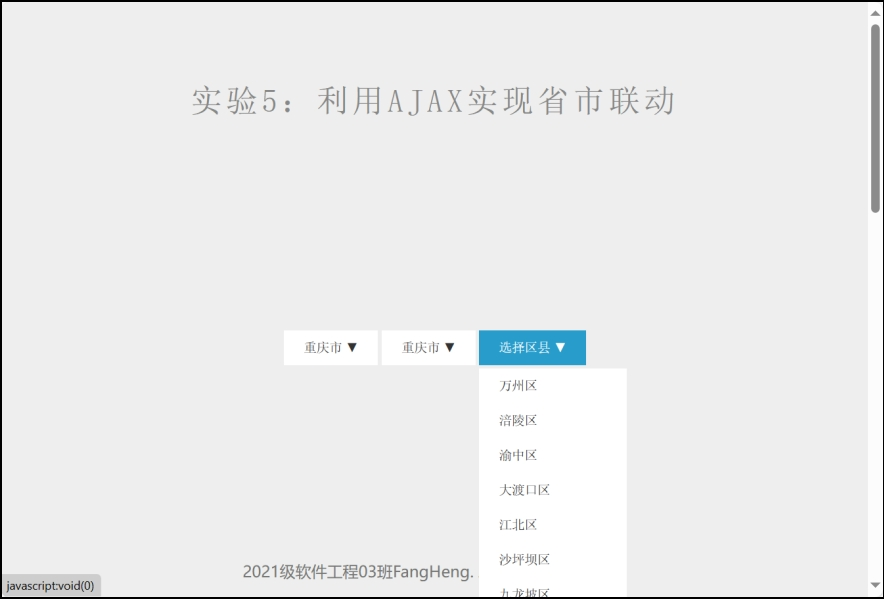

# CQU_webDevelopment

这是重庆大学大数据与软件学院Web开发技术课程实验代码。

> 课程比较没意思，老师上课不太好评价，实验也偏简单。
> 
> 我下面的实验内容仅为完成课程实验，很多写法和实现逻辑并不优雅。**很多地方不值得学习借鉴，所以请理性看待。**

> _**Note:** 本仓库的所有内容仅供学习和参考之用，禁止用于商业用途。使用本仓库代码时，您应自行承担所有风险和责任。作者不对因使用这些代码而可能产生的任何问题（包括但不限于代码重复、与项目要求不符、学业成绩受影响等）承担任何责任。请在充分理解免责说明的基础上谨慎使用，并确保遵守所有适用的法律法规。对于因使用本仓库内容而引起的任何法律责任，作者不承担任何责任。使用本仓库的内容即表示您同意本免责声明的所有条款和条件。_ 请参阅 [LICENSE](LICENSE) 文件了解更多信息。

## 实验1：Web时钟的实现

> 做一个自己的时钟页面（可用HTML5+CSS3 或者Web UI库/框架），可创新设计时钟界面。提交实验报告文档。

**效果展示**

## 实验2：Web计算器的实现

> 用HTML和CSS构造计算器界面，用Javascript至少实现加、减、乘、除功能。请充分利用面向对象的思想，使此计算器功能更加完善，包括键盘操作功能等。

**效果展示**

**备注**

实现了鼠标点击实现以及键盘输入的功能

## 实验3：网页版照片浏览器的设计与实现

> 设计与实现一个网页版照片浏览器，要求：照片可在后台上传到服务器，在浏览器端，可以按照片拍摄时间顺序、照片拍摄地点等方式查询照片，也可顺序或倒序翻看所有照片。实现语言不限。提交实验报告文档。
>
> 在浏览照片的上方增加查询条件的设置，可以按照片拍摄的地点和时间进行查询。上载照片的时候不仅仅上载照片图像，还要输入照片的拍摄时间和拍摄地点进行管理。有能力的同学可实现自动获取照片的拍摄时间和拍摄地点进行保存。

这次实验中使用django后端简单配置了一个前端页面来完成照片浏览器的设计。

**效果展示**

- 主页index截图：

 

- 主页index动画截图（鼠标靠近会显示大图）：

 

- 图片上传upload界面：

 

- 可以选择文件进行上传，在代码部分已经限制了只能选择图片格式的文件：

 

- 输入简单的文字描述：

 

- 选择提交，提示成功/失败弹窗：

- 图片展览部分

 

- 展览部分动画（当鼠标靠近时会自动展开）

 

- 展览部分动画（点击加号可以查看大图）

 

- 展览筛选功能（按地区筛选），这里实现时考虑了级联选择功能，选择不同国家省市之后会自动更新后续的可选范围，使用Ajax方法实现。

 

 

可以看到较好的完成了地点的筛选，值得注意的是，我也将筛选条件保存在url地址中（例如上面截图中的：http://localhost/gallery/?country=中国&province=浙江省&city=嘉兴市&district=）

- 可以选择根据拍摄时间/上传日期进行排序：

 

- 这里以拍摄时间升序来验证功能：

 

- 这里以拍摄时间降序来验证功能：

## 实验4：Web服务的定制与调用

> Web服务是一个可供外界通过Web调用的应用程序API，因此，也可将Web服务看作Web上的组件编程。
>
> 本实验要求大家参考教材，在Visual Studio 中，创建一个Web服务，该Web服务的功能是：接收请求，对页面输入的多个数值进行排序，并将排序结果回发给请求页面。
>
> 随后，在新的网页中调用该Web服务，即向Web服务发送页面输入的多个数值，请求排序，并接收Web服务的应答，在页面上显示排序结果。

这个实验主要是web服务的设置，老师的网课可以是一个参考。（但是确实过时了，所以做着图一乐就可以）

**效果展示**

## 实验5：利用ajax实现省市联动

> 每个省份下面有很多城市，当用户选择不同的省份后，相应城市列表的名称利用Ajax方法马上从数据库中取出，并迅速地进行异步更新。

这个实验比较简单。

**数据格式**

**效果展示**

